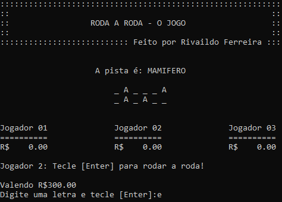

<h1 align="center">
  
 </h1>

  <a href="https://github.com/F3RREIRA/LG1A1/blob/main/README.md#%EF%B8%8F-reposit%C3%B3rio">Repositório</a>&nbsp;&nbsp;&nbsp;|&nbsp;&nbsp;&nbsp;
  <a href="#-ifsp">IFSP</a>&nbsp;&nbsp;&nbsp;|&nbsp;&nbsp;&nbsp;
  <a href="#-curso">Curso</a>&nbsp;&nbsp;&nbsp;|&nbsp;&nbsp;&nbsp;
  <a href="#-disciplina">Disciplina</a>&nbsp;&nbsp;&nbsp;|&nbsp;&nbsp;&nbsp;
  <a href="#-projeto">Projeto</a>&nbsp;&nbsp;&nbsp;|&nbsp;&nbsp;&nbsp;
  <a href="#-tecnologias">Tecnologias</a>&nbsp;&nbsp;&nbsp;|&nbsp;&nbsp;&nbsp;
  <a href="#-publicação">Publicação</a>&nbsp;&nbsp;&nbsp;
 

 
  

## 🗃️ Repositório

Esse repositório, apresenta os trabalhos desenvolvidos dentro da disciplina de Lógica de Programação I, do Curso Superior de Tecnologia em Análise e Desenvolvimento de Sistemas (TADS), no Instituto Federal de Educação, Ciência e Tecnologia de São Paulo - IFSP.

## 🏫 IFSP

O Instituto Federal de Educação, Ciência e Tecnologia de São Paulo - IFSP – é uma autarquia federal de ensino.

Fundada em 1909, como Escola de Aprendizes Artífices, é reconhecida pela sociedade paulista por sua excelência no ensino público gratuito de qualidade.

Durante sua história, recebeu, também, os nomes de Escola Técnica Federal de São Paulo - ETFSP e Centro Federal de Educação Tecnológica de São Paulo - CEFET. 

Com a transformação em Instituto, em dezembro de 2008, passou a ter relevância de universidade, destacando-se pela autonomia. Acesse o portal do [IFSP](https://spo.ifsp.edu.br/) para mais informações.

## 👨‍💻 Curso

O Curso Superior de Tecnologia em Análise e Desenvolvimento de Sistemas (TADS) do Câmpus São Paulo tem como objetivo capacitar o egresso a atuar na área de Tecnologia de Informação e Comunição (TIC) em atividades como análise, projeto, implementação, gerenciamento e implantação de sistemas de informação. Esta capacitação é pautada pela valorização da autonomia do estudante, prática em competências técnicas, e atualização diante da realidade tecnológica, de modo que o profissional seja um mediador competente entre o desenvolvimento tecnológico e a sociedade em que se insere. Acesse o portal do [IFSP](https://spo.ifsp.edu.br/tads) para mais informações.

## 📚 Disciplina

A disciplina Lógica de Programação I, apresenta as estruturas básicas para manipulação de algoritmos abordando a metodologia estruturada. Este componente curricular desenvolve os conceitos clássicos da programação estruturada como: controle para o fluxo de execução de um programa, as funções para manipulação e abstrações de dados, proporcionando ao aluno o conhecimento das diretrizes e boas práticas de programação que serão utilizadas em outros componentes curriculares.

## 💻 Projeto

O projeto Roda a Roda é o trabalho final da disciplina de Lógica de Programação I, que foi entregue como forma de avaliação semestral.
Trata-se de uma simulação do jogo Roda a Roda, programa de auditório apresentado na TV.

Para acessar o repositório com os códigos fonte do projeto, basta clicar no link abaixo:

- [Roda a Roda](https://github.com/F3RREIRA/LG1A1)

## 🚀 Tecnologias

O projeto foi desenvolvido utilizando as seguintes tecnologias:

- [Linguagem C](https://pt.wikipedia.org/wiki/C_(linguagem_de_programa%C3%A7%C3%A3o))
- [Dev C++ IDE](https://www.bloodshed.net/)

## 🌎 Publicação

Para executar e testar as funcionalidades da aplicação, basta fazer o download do repositório, extrair os arquivos e executar o arquivo "roda.exe", que está dentro da pasta "Projeto roda a roda":

  
  
---
 

 
 

